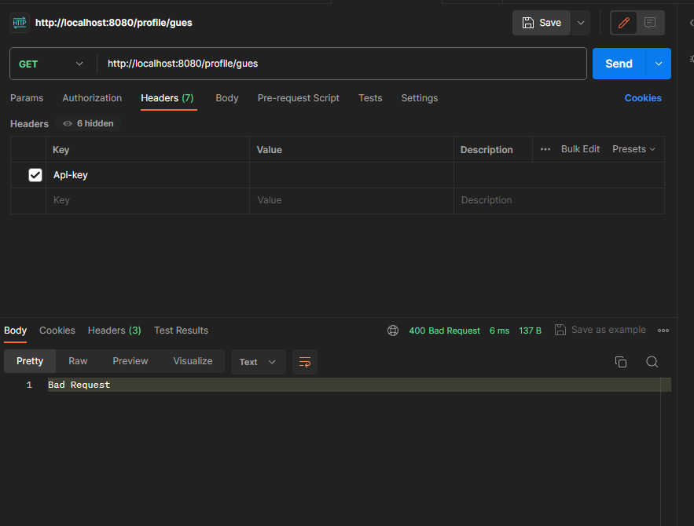
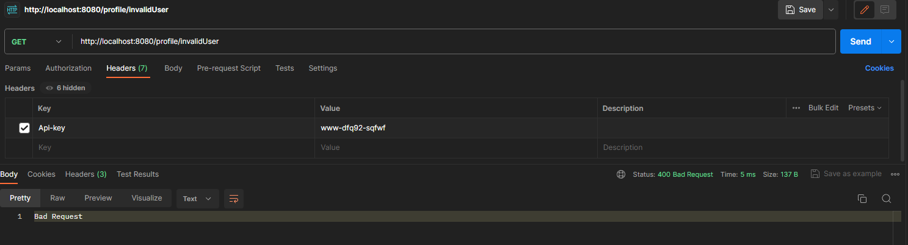
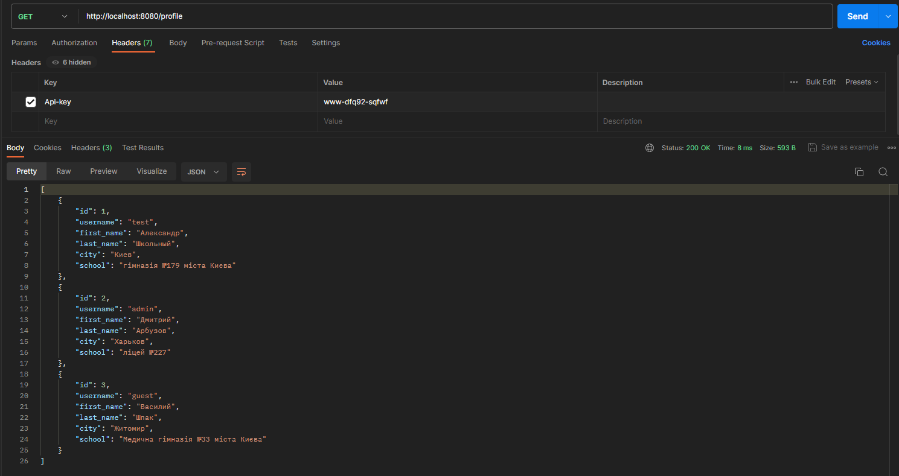
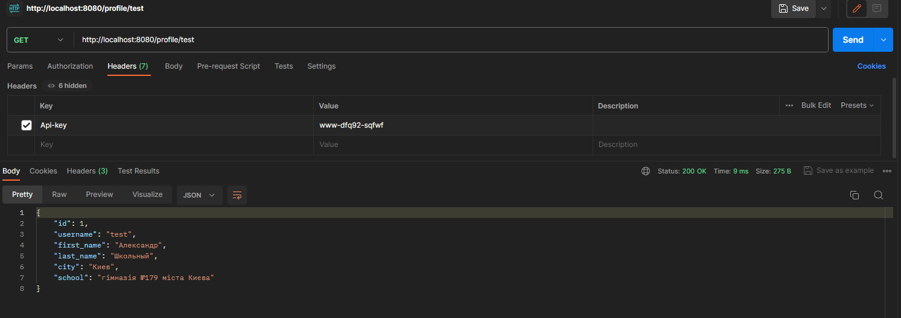

# school-outh

This Go service provides 'Api-key' authenticated access to user data through the '/profile' endpoint.
## Domain

There is a /profile endpoint that handles GET requests.

The GET /profile request requires an "Api-Key" header to authenticate. This Api-Key is compared against those stored in the auth database table. If an invalid key is provided, a 403 forbidden error is returned.

An authentication middleware handler was implemented that checks the Api-Key before allowing requests to the /profile endpoint to proceed.

The database structure and initial data was imported from the provided scheme.sql and data.sql files on service startup. Additional constraints were added to the database tables after import.

The GET /profile endpoint returns JSON user data. If a "username" parameter is provided, just that single user's data is returned. Otherwise, data for all database users is returned.

The JSON user data contains the id, username, first_name, last_name, city and school fields. This is aggregated from the user, user_profile and user_data tables.

## Repository overview

### [`/cmd`](cmd)
This directory contains main.go file, which contains the main function that serves as the starting point of the application.

### [`/internal`](internal)
It holds several files that contain logic for the application:

### [`/migrations`](migrations)
This directory contains migration files that define the logic for evolving the application's database schema over time.

## Solution

MySQL - MySQL was used as the database for persistent storage via SQL. Database access was handled through Go's database/sql package. The database schema and seed data was imported from the provided SQL scripts.

sqlc - The sqlc developer tool was used to auto-generateORM models and DB access code from the SQL schema. This eliminated the need to handwrite data access boilerplate. The generated Go code interfaced with the database.

Docker Compose - A docker-compose file was used to define and orchestrate Docker containers for the Go service and MySQL database. This automated container builds and networking. Service could be started via a single docker-compose command.

Viper - The Viper library was used for configuration management in the Go service. Configuration options were defined in a config file and loaded/parsed by Viper on startup. Options included database credentials, server port, etc. Values could be overridden via flags or environment variables.

## Performance

There was done only manual testing.

Forbidden(no auth_key)

Bad request (get unexciting user)

Get all profiles(key not specified)

Get profile by username

## Possible improvements

* Improve error handling.
* Add unit tests.
